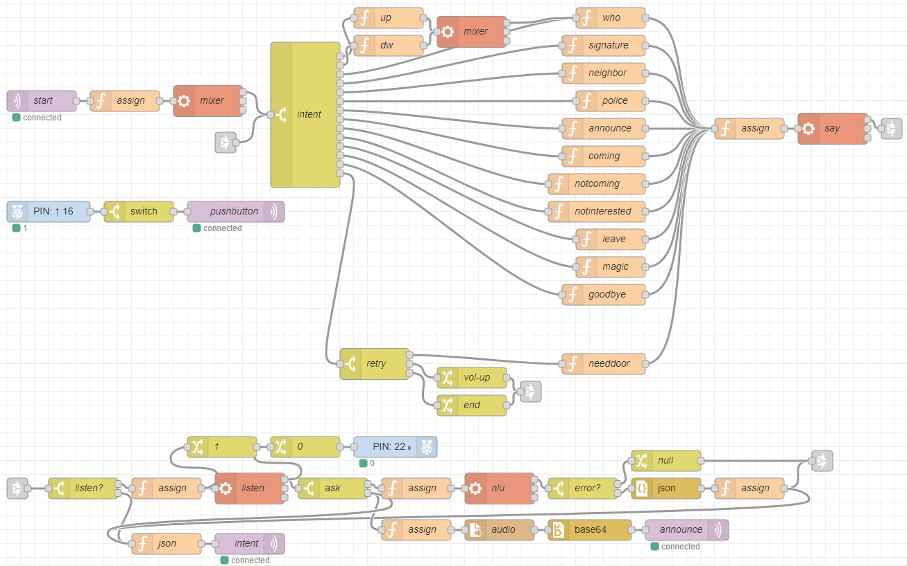

# Door Butler
Interactive voice assistant that helps identifies who is at the door and route visitors 
## Goals
Wish list of capabilities:
* Smart voice screening 
* Dialog management 
* Led status indicator 
* Prerecorded answers 
* MQTT 
* Video streaming 
* Presence detection 
* REST API 
* Two-way audio 
## Hardware
* Raspberry Pi Zero W 
* Google AIY voice hat 
* PlayStation Eye  
## Software
* [WIT.AI](https://wit.ai/)
* Node-red 

## Installation
1. Install [Raspberry Pi OS](https://www.raspberrypi.org/downloads/) to an SD card
2. Install [Node-Red](https://nodered.org/docs/getting-started/raspberrypi)
3. Navigate to http://<hostname>:1880 and import the [DoorButler flow](https://github.com/RABCbot/door-butler/blob/master/node-red/butler-flow.json)

